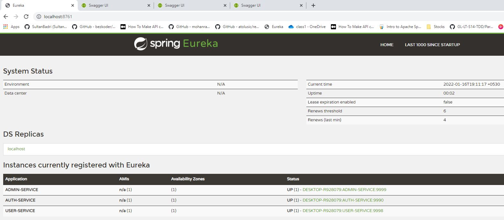

##### Week 15 Projects
#### Back End
### Run Micro service API

#Create a postgres DB and tables ("shurabhi1"), using script in "SQL" file in the root path

## Start APIs in below sequence
    1. shurabhi-server(eureka) -> http://localhost:8761/
    2. auth-server -> http://localhost:9990/swagger-ui.html#/
    3. shurabhi-user -> http://localhost:9998/swagger-ui.html#/users-controller
    4. shurabhi-admin -> http://localhost:9999/swagger-ui.html#/admin-controller

#### Front End

In the project directory, you can run:

### `npm install`

### `npm start`

Runs the app in the development mode.\
Open [http://localhost:3000](http://localhost:3000) to view it in the browser.

#### UI

